# Lab 13: Essbase on OCI

## Introduction

This lab walks through the steps to deploy an instance of Essbase 19c with all its required settings. We will then setup an IDCS confedential application to monitor the Essbase 19c instance. We will also learn how to access the backend of Essbase 19c instance using SSH keys, and the frontend using IDCS login.

## Objectives

* Setup IDCS Confidential Application
* Install the pre-requisites and the instance of Essbase 19c on OCI 
* Accessing backend of Essbase 19c using SSH keys

## Required Artifacts

* The following lab requires an Oracle Public Cloud account with IDCS & OCI administrator access for the process of deployment of Essbase19c on OCI.

*Note:* The estimated time to complete this lab is 45 minutes.

## Part 1: Login to IDCS with Administrator privileges

1.	Log in to Identity Cloud Service as the identity domain administrator. To get to the Identity Cloud Service console from Oracle Cloud Infrastructure, click Identity, then Federation, and click on the URL link next to Oracle Identity Cloud Service Console. 


2.	In the Identity Cloud Service console, expand the navigation drawer icon, click Settings, and then click Default Settings as below. 

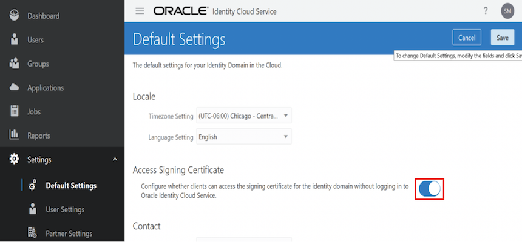

3.	Turn on the switch under Access Signing Certificate to enable clients to access the tenant signing certificate without logging in to Identity Cloud Service as above. 

4.	Scroll up and click Save to store your changes as below .


5.	If not already created, create a user in Identity Cloud Service who will be the initial Essbase Service Administrator. See Create User Accounts. 

## Part 2: Create a Confidential Identity Cloud Service Application

Before deploying the Essbase stack, create a confidential application in Oracle Identity Cloud Service and register Essbase with it. 

1.	On the “Dashboard” page , please click on the Application tab as shown in below figure 


2.	Please click on the Confidential Application as shown below


3.	Enter a Name & Description for the Essbase Application that is under creation and click Next.


4.	In the Client step, select the option Configure this application as a client now.

## In the Authorization section, 

* Select the following allowed grant types: Client Credentials and Authorization Code. 
* Select allow non-HTTPS URLs. 
	1. For the Essbase Redirect URL, enter a temporary/mock redirection URL (it ends with _uri): http://ip/essbase
	2. For the Essbase Post Logout Redirect URL, enter a temporary/mock URL: http://ip/essbase

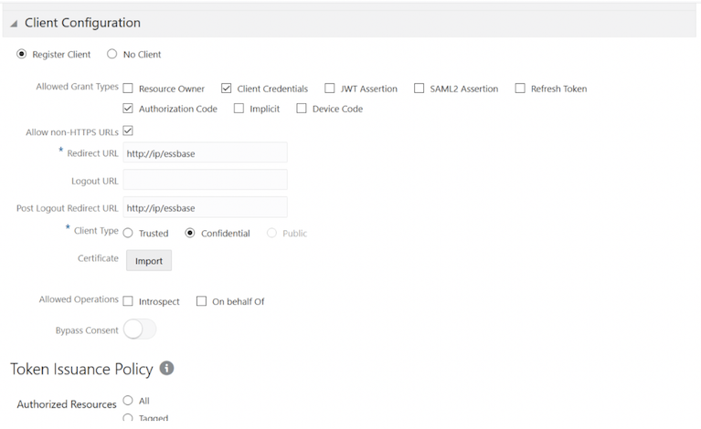

Under Token Issuance Policy, in the section Grant the client access to Identity Cloud Service Admin APIs, click Add, find and select the Identity Domain Administrator role, and select Add. 


* Scroll to the top of the page and click Next until you reach the Authorization section. 
* Click Finish. 
* From the Application Added popup window, record the following Identity Cloud Service details: IDCS Application Client ID and IDCS Application Client Secret. Record these values to use during your Essbase deployment.


* Record the IDCS Instance GUID from the following location: in the Identity Cloud Service Console, select your ID icon in the top right corner (the icon contains your initials), select About, and record the IDCS Instance GUID value. If you don't have access, ask your administrator to provide it. Example: idcs-123456789a123b123c12345678d123e1. Alternatively, the IDCS Instance GUID is at the front of the IDCS url in the browser - take the host portion of the url.
* Select Activate in the title bar, next to your application's name.

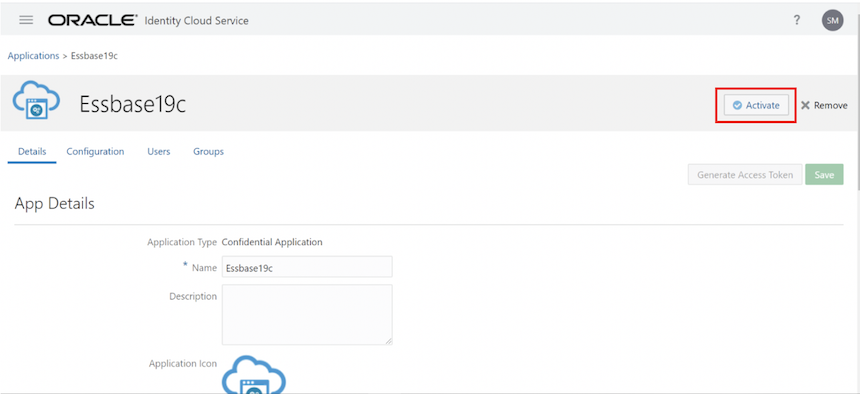

Now click on users tab of this application toolbar & add the current user to the application using Assign option.

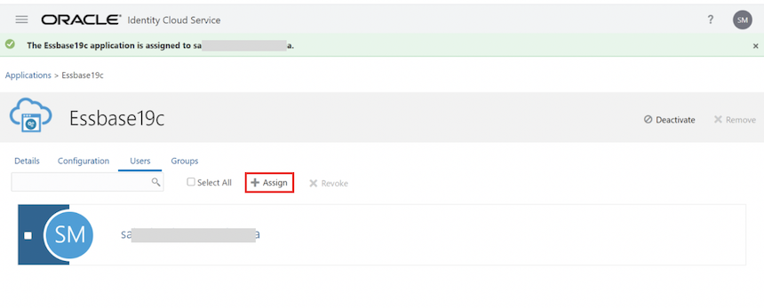

## Part 3: Compartment Creation

1.	Create a new compartment by going to Identity -> Compartments in OCI console and you can create under parent compartment of your choice. 


2.	Note down the COMPARTMENT OCID.


## Part 4: Dynamic Group Creation

1.	Create a Dynamic group, which is under Identity Dynamic Group,  so that instances under this group will have permissions to manage OCI resources.
2.	Select “ANY OF THE FOLLOWING RULES” as rules for match.
3.	Select “Match Instances in Compartment ID” as attribute.
4.	Now paste the Compartment OCID noted before & click on Add Rule.


## Part 5: Setup Policies for Essbase19c Stack creation

### To create policies:

1.	On the Oracle Cloud Infrastructure console, navigate to the left icon under the Governance and Administration section, click Identity, select Policies, select the root compartment, and then click Create Policy. 
2.	Provide a name and description for the policy.
3.	Add the policy statements (Allow) as given [here] (https://docs.oracle.com/en/database/other-databases/essbase/19.3/essad/set-policies.html) for both Admin group and Dynamic Group Policies. Specify the group_name in the policy statement.


4.	When done, click Create.

Similarly create a policy each, for both groups and dynamic groups, as necessary with policy statements give [here] - (https://docs.oracle.com/en/database/other-databases/essbase/19.3/essad/set-policies.html)

## Part 6: Encrypt Values Using KMS

Key Management (KMS) enables you to manage sensitive information when creating a server domain. 

When you use KMS to encrypt credentials during provisioning, you need to create a key. Passwords chosen for Essbase administrator and Database must meet the Resource Manager password requirements.

Keys need to be encrypted for the following fields: 
•	Essbase Administrator Password
•	IDCS application client secret
•	Database system administrator password

### Creation of KMS Vaults & Keys.

* Sign in to the Oracle Cloud Infrastructure console. 
* In the navigation menu, select Security, and click Vault.

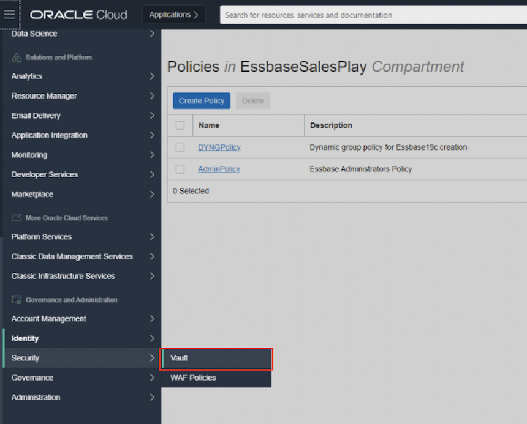

Select your Compartment, if not already selected. 
* Click Create Vault. 
* For Name, enter OracleEssbaseVault. 
* For the lower-cost option, leave unchecked the option to make it a virtual private vault. 
* Click Create.


* Click on the new vault we created in the previous steps. 
* Record the Cryptographic Endpoint URL for later use. 
* Click Keys, and then click Create Key. 


* For Name, enter OracleEssbaseKey. 
* Click Create Key. 
* Click the new key.


* Record the OCID value for the key, for later use. 


*Note that Essbase uses the same key to decrypt all passwords for a single domain.*

### To encrypt your Oracle Essbase Administrator password:

Refer the link - https://docs.oracle.com/en/database/other-databases/essbase/19.3/essad/encrypt-values-using-kms.html

* Convert the administrator password that you want to use for the Essbase domain to a base64 encoding. 
For example, from a Linux terminal, use this command:
  
  
```
echo -n 'OracleEssbase_Password' | base64
```
* Run the encrypt oci command using Oracle Cloud Infrastructure command line interface. 

Provide the following parameters: 
	1. Key's OCID
	2. Vault's Cryptographic Endpoint URL
  3. base64-encoded password

```
oci kms crypto encrypt --key-id Key_OCID --endpoint Cryptographic_Endpoint_URL --plaintext Base64_OracleEssbase_Password

```
* From the output, copy the encrypted password value for use in the deploy process, as shown here: 

```
"ciphertext": "Encrypted_Password"
```
* You also use KMS encryption to encrypt your Database Password and your Client Secret. 

## Part 7: Deploy Oracle Essbase

As the Oracle Cloud Infrastructure administrator, you use Oracle Cloud Infrastructure to set up Essbase. Oracle Cloud Marketplace uses Oracle Resource Manager to provision the network, compute instances, Autonomous Transaction Processing database for storing Essbase metadata, and Load Balancer. 

1.	Sign into Oracle Cloud Infrastructure console as the Oracle Cloud Infrastructure administrator.
2.	From the navigation menu, select Marketplace.

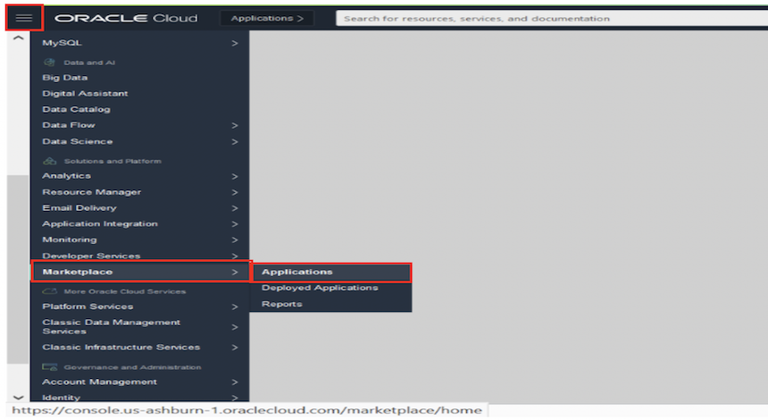

3.	On Oracle Marketplace page,
a.	In the title bar, select or accept the region from which to run the deployment.
b.	In the Category dropdown menu, select Database Management. 
c.	Under All Applications, select Oracle Essbase BYOL.

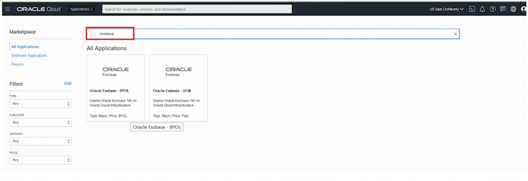

d.	Select the stack version, or accept the default.
e.	From the dropdown menu, select the target Compartment that you created for Essbase, in which to create the stack instance. 
f.	Select the check box to indicate you accept the Oracle Standard Terms and Restrictions.
g.	Click Launch Stack.


4.	In Stack Information, on the Create Stack page.
a.	Enter a stack name, description, and any other stack information as necessary.
b.	Click Next.

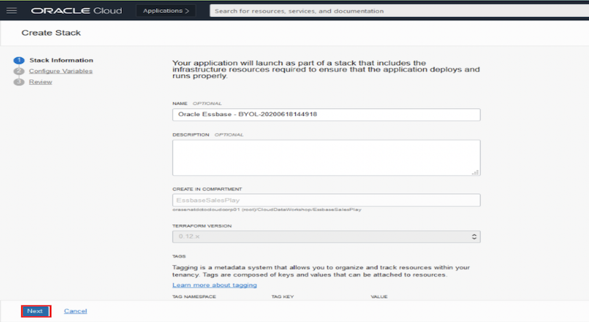

5.	In General Settings, on the Configure Variables page, you configure variables for the infrastructure resources that the stack creates. 
a.	[Optional] Enter Resource Display Name Prefix value to use to identify all generated resources, for example essbase_<userid>. If not entered, a prefix is assigned. 
The target compartment you previously selected is shown.
b.	Enter values for KMS Key OCID and KMS Service Crypto Endpoint for encrypting credentials during provisioning.
c.	[Optional] Select Show Advanced Options if you want to enable additional network configuration options under Network Configuration. Use this if you plan to create a new virtual cloud network (VCN) or subnets.

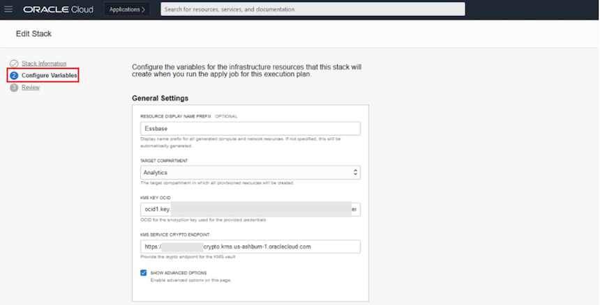
	
6.	In Essbase Instance:
a.	Select an availability domain in which to create the Essbase compute instance. Enter the shape for the Essbase compute instance.
b.	Enter the data volume size or accept the default.
c.	Paste the value of the SSH public key that you created, to access the Essbase compute instance.
d.	In the Essbase System Admin User Name field, enter an Essbase administrator user name and password - which is encrypted by KMS key as part of To encrypt your Oracle Essbase Administrator password. It can be an Identity Cloud Service user, but it doesn’t have to be. It provides an additional way (if necessary) to log in to Essbase, and is also the administrator used to Access the WebLogic Console on which Essbase runs. If you don't enter an Identity Cloud Service user in this field, then you must provide one in the IDCS Essbase Admin User field later in the stack definition, in the Security Configuration section. If you enter an Identity Cloud Service user in this field, then the Identity Cloud Service System Administrator User ID is optional in the Security Configuration section.


7.	In Security Configuration:
a.	Select IDCS for use with your production instances. To set up security and access for Essbase 19c, you integrate Essbase with Identity Cloud Service as part of the stack deployment. The Embedded option is not recommended or supported for production instances.
b.	Enter the IDCS Instance GUID, IDCS Application Client ID, and IDCS Application Client Secret values – which is encrypted by KMS key as part of To encrypt your Oracle Essbase Administrator password , which you recorded as pre-deployment requirements, after you created a confidential Identity Cloud Service Application.
c.	Enter IDCS Essbase Admin User value. This cannot be the same user ID as the Essbase administrator. Additionally, this user ID must already exist in the Identity Cloud Service tenancy. If you do not provide this user ID during stack creation, or if its mapping to the initial Essbase administrator doesn't happen correctly, you can later use the Identity Cloud Service REST API to create this user and link it to Essbase. See REST API for Oracle Identity Cloud Service.

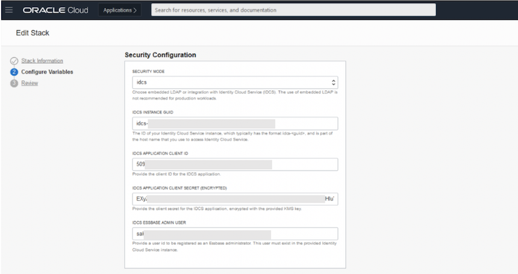

8.	In Network Configuration, if you DID select Show Advanced Options under General Settings:
a.	Select the Assign Public IP address option as below, which creates a whole new VCN automatically for the Essbase deployment.

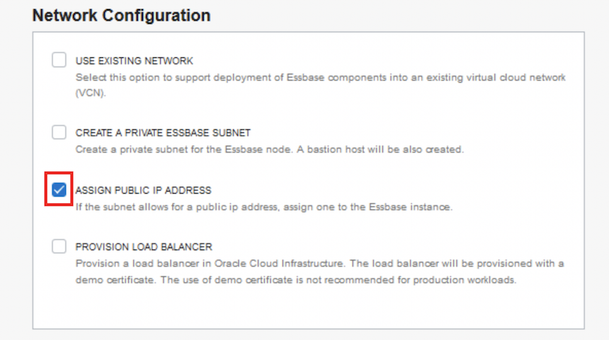

9.	In Database Configuration, perform the following configuration tasks to create new Autonomous Database for this deployment:
Database configuration tasks:
a.	Enter a database admin user password - which is encrypted by KMS key as part of To encrypt your Oracle Essbase Administrator password.
b.	Select the database license or accept the default.
c.	Click Next.

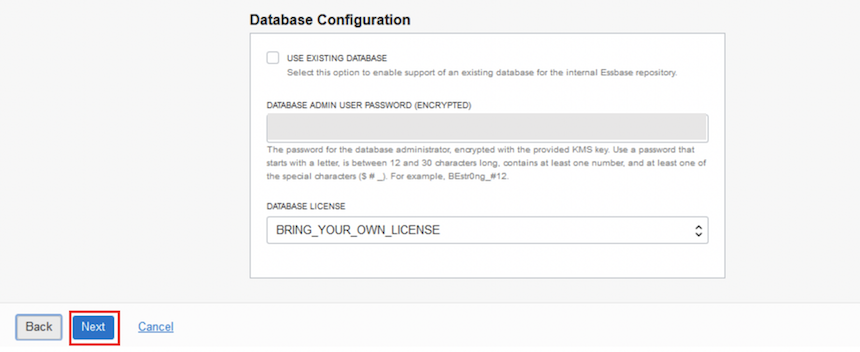

10.	On the Review page, review the information that you provided, and click Create. The Job Information tab in Oracle Resource Manager shows the status until the job finishes and the stack is created.
11.	Check for any log errors. If you have any, see Troubleshoot Deployment Errors.
12.	If the job is executed without any errors we can see the Job Successful state in green color as below.

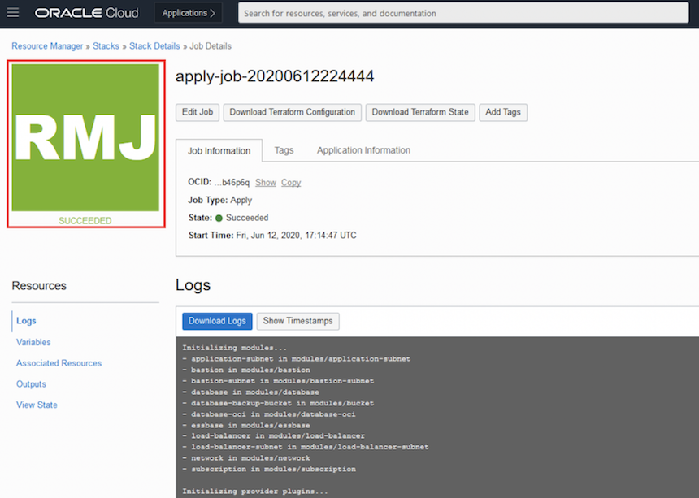

13.	From the Application Information page, the value for essbase_url is used in the browser to access Essbase. The essbase_node_public_ip is for accessing SSH.
14.	After you deploy the stack, now complete the post-deployment tasks, including update your created Identity Cloud Service application, test connectivity to Essbase, and others.


You can modify the created resources and configure variables later. Logs are created that can be forwarded to Oracle Support, if necessary for troubleshooting. After deployment, you're ready to assign users to roles and permissions in the Essbase web interface. You can also perform additional network and security configuration. 
	
## Part 8: Post-Deployment Tasks 

Once we have the outputs generated & job executed successfully, we need to update these endpoints i.e. Essbase Redirect URL and Essbase Post Logout Redirect URL back in the Essbase IDCS Confidential Application, where we fed temporary URL’s as below.


Now we can test the connectivity to Essbase 19c by clicking on Essbase external URL.


By getting this we confirm that we have successfully deployed Essbase19c.


