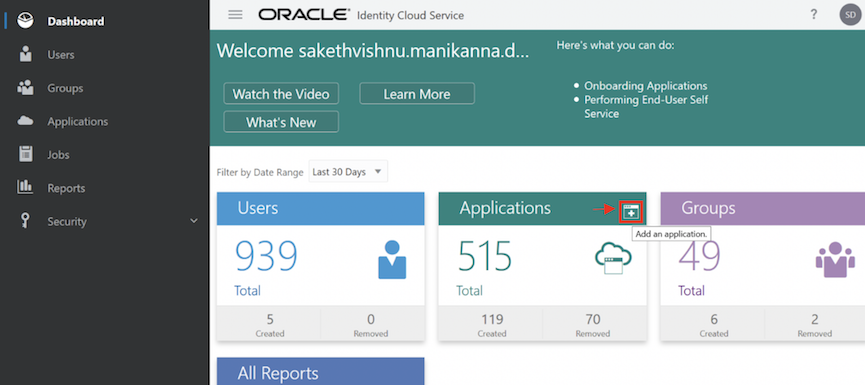
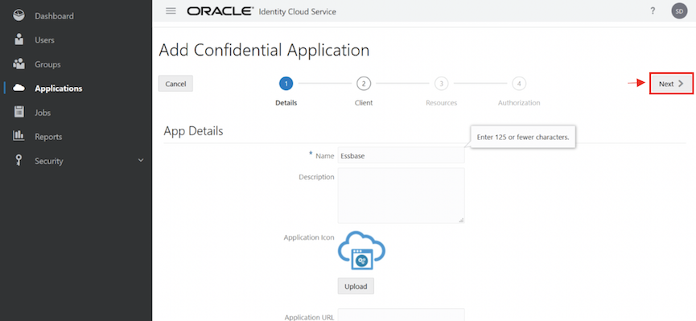
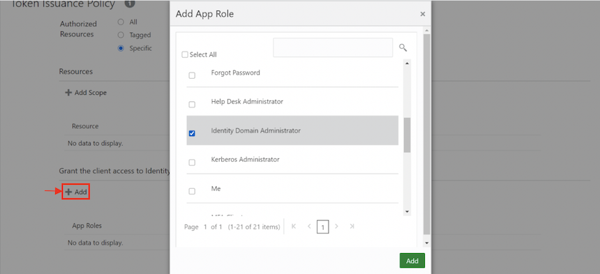
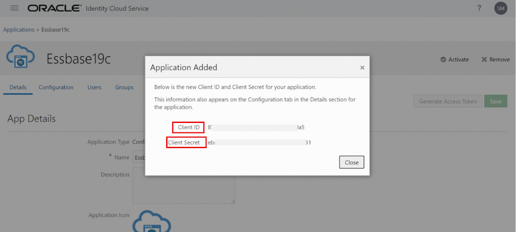
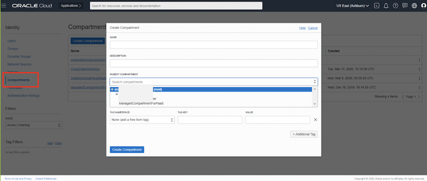
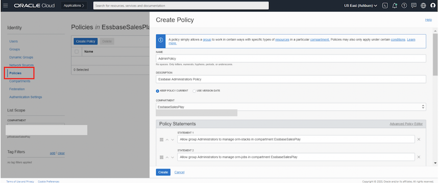
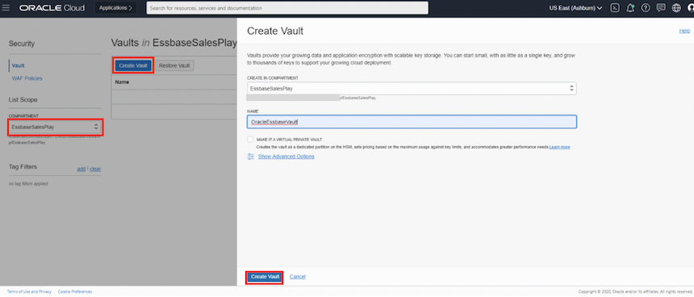
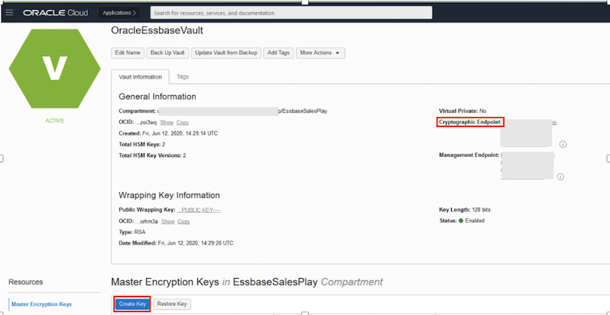
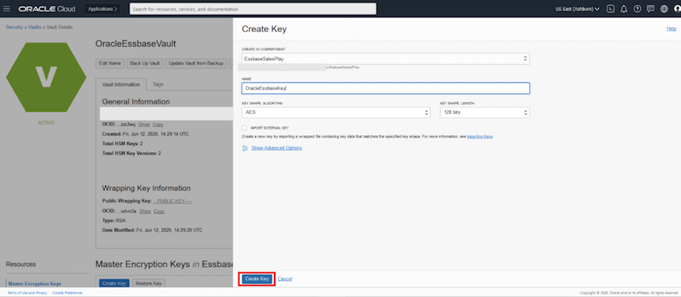

# Lab 13: Essbase on OCI

## Login to IDCS with Administrator privileges

1.	Log in to Identity Cloud Service as the identity domain administrator. To get to the Identity Cloud Service console from Oracle Cloud Infrastructure, click Identity, then Federation, and click on the URL link next to Oracle Identity Cloud Service Console. 


2.	In the Identity Cloud Service console, expand the navigation drawer icon, click Settings, and then click Default Settings as below. 


3.	Turn on the switch under Access Signing Certificate to enable clients to access the tenant signing certificate without logging in to Identity Cloud Service as above. 

4.	Scroll up and click Save to store your changes as below .


5.	If not already created, create a user in Identity Cloud Service who will be the initial Essbase Service Administrator. See Create User Accounts. 

## Create a Confidential Identity Cloud Service Application

Before deploying the Essbase stack, create a confidential application in Oracle Identity Cloud Service and register Essbase with it. 

1.	On the “Dashboard” page , please click on the Application tab as shown in below figure 



2.	Please click on the Confidential Application as shown below


3.	Enter a Name & Description for the Essbase Application that is under creation and click Next.



4.	In the Client step, select the option Configure this application as a client now.

* In the Authorization section, 
•	Select the following allowed grant types: Client Credentials and Authorization Code. 
•	Select allow non-HTTPS URLs. 

a.	For the Essbase Redirect URL, enter a temporary/mock redirection URL (it ends with _uri): http://ip/essbase
b.	 For the Essbase Post Logout Redirect URL, enter a temporary/mock URL: http://ip/essbase


Under Token Issuance Policy, in the section Grant the client access to Identity Cloud Service Admin APIs, click Add, find and select the Identity Domain Administrator role, and select Add. 



* Scroll to the top of the page and click Next until you reach the Authorization section. 
* Click Finish. 
* From the Application Added popup window, record the following Identity Cloud Service details: IDCS Application Client ID and IDCS Application Client Secret. Record these values to use during your Essbase deployment.



* Record the IDCS Instance GUID from the following location: in the Identity Cloud Service Console, select your ID icon in the top right corner (the icon contains your initials), select About, and record the IDCS Instance GUID value. If you don't have access, ask your administrator to provide it. Example: idcs-123456789a123b123c12345678d123e1. Alternatively, the IDCS Instance GUID is at the front of the IDCS url in the browser - take the host portion of the url.
* Select Activate in the title bar, next to your application's name.


Now click on users tab of this application toolbar & add the current user to the application using Assign option.


## Compartment Creation

1.	Create a new compartment by going to Identity -> Compartments in OCI console and you can create under parent compartment of your choice. 



2.	Note down the COMPARTMENT OCID.


## Dynamic Group Creation

1.	Create a Dynamic group, which is under Identity      Dynamic Group,  so that instances under this group will have permissions to manage OCI resources.
2.	Select “ANY OF THE FOLLOWING RULES” as rules for match.
3.	Select “Match Instances in Compartment ID” as attribute.
4.	Now paste the Compartment OCID noted before & click on Add Rule.


## Setup Policies for Essbase19c Stack creation

### To create policies:

1.	On the Oracle Cloud Infrastructure console, navigate to the left icon under the Governance and Administration section, click Identity, select Policies, select the root compartment, and then click Create Policy. 
2.	Provide a name and description for the policy.
3.	Add a policy statement (Allow) for each instance in the compartment. Copy them from your text worklist file. Specify the group_name in the policy statement.



4.	When done, click Create.

Similarly create a policy each, for both groups and dynamic groups, as necessary with policy statements give here - https://docs.oracle.com/en/database/other-databases/essbase/19.3/essad/set-policies.html.

## Encrypt Values Using KMS

Key Management (KMS) enables you to manage sensitive information when creating a server domain. 

When you use KMS to encrypt credentials during provisioning, you need to create a key. Passwords chosen for Essbase administrator and Database must meet the Resource Manager password requirements.

Keys need to be encrypted for the following fields: 
•	Essbase Administrator Password
•	IDCS application client secret
•	Database system administrator password

### Creation of KMS Vaults & Keys.

* Sign in to the Oracle Cloud Infrastructure console. 
* In the navigation menu, select Security, and click Vault.


Select your Compartment, if not already selected. 
* Click Create Vault. 
* For Name, enter OracleEssbaseVault. 
* For the lower-cost option, leave unchecked the option to make it a virtual private vault. 
* Click Create.



* Click on the new vault we created in the previous steps. 
* Record the Cryptographic Endpoint URL for later use. 
* Click Keys, and then click Create Key. 



* For Name, enter OracleEssbaseKey. 
* Click Create Key. 
* Click the new key.



* Record the OCID value for the key, for later use. 


*Note that Essbase uses the same key to decrypt all passwords for a single domain.*

### To encrypt your Oracle Essbase Administrator password:

Refer the link - https://docs.oracle.com/en/database/other-databases/essbase/19.3/essad/encrypt-values-using-kms.html

* Convert the administrator password that you want to use for the Essbase domain to a base64 encoding. 
For example, from a Linux terminal, use this command:
  
  
```
echo -n 'OracleEssbase_Password' | base64
```
* Run the encrypt oci command using Oracle Cloud Infrastructure command line interface. 

Provide the following parameters: 
	1. Key's OCID
	2. Vault's Cryptographic Endpoint URL
  3. base64-encoded password

```
oci kms crypto encrypt --key-id Key_OCID --endpoint Cryptographic_Endpoint_URL --plaintext Base64_OracleEssbase_Password

```
* From the output, copy the encrypted password value for use in the deploy process, as shown here: 

```
"ciphertext": "Encrypted_Password"
```
* You also use KMS encryption to encrypt your Database Password and your Client Secret. 
